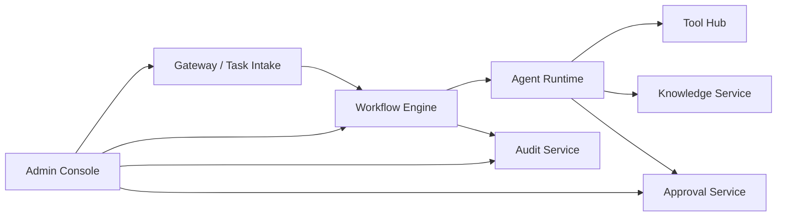

# BizFlow Agent Hub

BizFlow Agent Hub là nền tảng workflow-first để tự động hóa nghiệp vụ với các agent tự build. Repo này cung cấp MVP chạy local đầy đủ: intake task, orchestration, agent runtime, tool hub, approval, knowledge, audit, và admin console.

## Tính Năng Chính
- Nhận task từ REST API, webhook, scheduler, manual form.
- Orchestrator theo state machine, có retry, lịch sử step, audit.
- Agent runtime với router/planner/context/policy/executor/validator/handoff.
- Tool Hub có approval gate và audit logging.
- Knowledge Service cho nội dung nội bộ.
- Admin Console hiển thị tasks, runs, approvals, audit, tools, agents.

## Kiến Trúc Tổng Thể


## Công Nghệ
- Backend: Java 21, Spring Boot 3.x, Maven, PostgreSQL, Redis
- Workflow: State machine (ready for Temporal)
- Agent Runtime: Python 3.11, FastAPI, Pydantic
- Frontend: React + Vite + Tailwind
- Observability: OpenTelemetry instrumentation (starter)

## Cấu Trúc Thư Mục
```
bizflow-agent-hub/
  apps/
    gateway-api/
    agent-runtime/
    admin-console/
  services/
    workflow-engine/
    tool-hub/
    approval-service/
    knowledge-service/
    audit-service/
  libs/
    shared-contracts/
    shared-security/
    shared-events/
  docs/
    architecture/
    api/
    workflows/
    runbooks/
    adr/
  infra/
    docker/
    scripts/
    db/
```

## Điều Kiện Môi Trường
- Java 21
- Maven 3.9+
- Python 3.11
- Node 18+
- Docker Desktop

## Chạy Local Nhanh
```bash
# 1) Start infra (Postgres/Redis/MinIO)
./infra/scripts/bootstrap.ps1

# 2) Run gateway
mvn -pl apps/gateway-api spring-boot:run

# 3) Run workflow engine
mvn -pl services/workflow-engine spring-boot:run

# 4) Run tool hub
mvn -pl services/tool-hub spring-boot:run

# 5) Run approval/knowledge/audit
mvn -pl services/approval-service spring-boot:run
mvn -pl services/knowledge-service spring-boot:run
mvn -pl services/audit-service spring-boot:run
```

## Chạy Toàn Bộ Hệ Thống Bằng 1 Lệnh (Script SH)
Script `infra/scripts/run-all.sh` sẽ chạy tuần tự toàn bộ stack, tự kiểm tra tool và tự cài thư viện còn thiếu.

```bash
bash infra/scripts/run-all.sh
```

Script sẽ:
1. Kiểm tra `docker`, `python`, `node`, `npm`, và tự cài Maven local nếu chưa có.
2. Khởi động `docker-compose` (Postgres/Redis/MinIO).
3. Build các service Java (skip tests).
4. Chạy từng service theo thứ tự và đợi `/actuator/health`.
5. Tạo venv Python, cài dependency và chạy Agent Runtime.
6. Cài npm dependencies và chạy Admin Console.
7. Ghi log vào thư mục `.run-logs/`.

## Chạy Agent Runtime
```bash
cd apps/agent-runtime
python -m venv .venv
.venv/Scripts/activate
pip install -e .
uvicorn app.main:app --reload --port 8090
```

## Chạy Admin Console
```bash
cd apps/admin-console
npm install
npm run dev
```

## Cấu Hình ENV
Dùng `.env.example` làm mẫu. Các service mặc định đọc config từ `application.yml` và env.

## Seed Data
Postgres sẽ tự load từ `infra/db/init` khi container khởi động lần đầu.

## API Chính
- `POST /api/tasks`
- `GET /api/tasks/{id}`
- `POST /api/workflows/run`
- `GET /api/workflows/runs/{id}`
- `POST /api/approvals/{id}/approve`
- `POST /api/approvals/{id}/reject`
- `GET /api/audit/{runId}`
- `GET /api/tools`
- `GET /api/agents`
- `POST /api/knowledge/search`

Xem thêm tại `docs/api/endpoints.md` và `docs/api/openapi.yaml`.

## Demo Workflows
### 1) Email/Ticket Automation
```bash
curl -X POST http://localhost:8081/api/tasks \
  -H "Content-Type: application/json" \
  -d '{"tenantId":"demo-tenant","source":"email","type":"email_support","payload":{"subject":"Login issue","body":"User locked out"}}'
```

### 2) Invoice/OCR Approval
```bash
curl -X POST http://localhost:8081/api/tasks \
  -H "Content-Type: application/json" \
  -d '{"tenantId":"demo-tenant","source":"upload","type":"invoice_approval","payload":{"invoice_id":"INV-001","amount":1500}}'
```

### 3) Policy Lookup Assistant
```bash
curl -X POST http://localhost:8081/api/tasks \
  -H "Content-Type: application/json" \
  -d '{"tenantId":"demo-tenant","source":"internal","type":"policy_lookup","payload":{"query":"invoice"}}'
```

## Approval Flow
- Tool Hub hoặc Policy Agent tạo approval request.
- Admin Console hiển thị Approval Queue.
- Duyệt qua `POST /api/approvals/{id}/approve`.

## Mở Rộng Agent / Tool / Workflow
1. Thêm agent mới trong `apps/agent-runtime/app/agents`.
2. Đăng ký tool mới ở Tool Hub (`tools` table) hoặc code seeder.
3. Thêm workflow mới trong Workflow Engine và cập nhật mapping.
4. Cập nhật docs và seed data.

## Testing
```bash
# Java services
mvn -pl apps/gateway-api test
mvn -pl services/workflow-engine test

# Agent runtime
cd apps/agent-runtime
pytest

# Admin console
cd apps/admin-console
npm run build
```

## Troubleshooting (Ngắn)
- Nếu Postgres lỗi, chạy lại `docker compose down -v` rồi `up`.
- Nếu port bị chiếm, đổi port trong `application.yml`.

## Tài Liệu Chi Tiết
- `docs/architecture/overview.md`
- `docs/architecture/agent-modules.md`
- `docs/architecture/workflow-engine.md`
- `docs/architecture/tool-hub.md`
- `docs/architecture/security.md`
- `docs/architecture/erd.md`
- `docs/runbooks/local-development.md`
- `docs/runbooks/user-guide.md`
- `docs/modules/workflow-engine.md`

## TODO / Roadmap
- Tích hợp Temporal thật.
- OpenTelemetry collector + tracing backend.
- Multi-tenant policy enforcement hoàn chỉnh.
- UI realtime với WebSocket.
