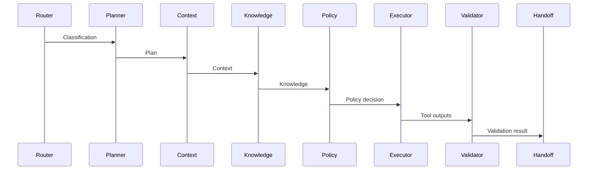

# Agent Modules

All agents implement a shared interface and use structured input/output (Pydantic models). Agents are orchestrated by the Agent Runtime in a deterministic order. Each agent is responsible for a narrow scope.

## Shared I/O
- **Input**: `AgentInput` (tenant_id, task_id, workflow, payload, correlation_id)
- **Output**: `AgentOutput` (status, data, notes)

## Agents

### 1. Router Agent
- **Purpose**: Classify the incoming task and select the workflow path.
- **Input**: Task payload metadata.
- **Output**: `{ classification: "support_request" | "invoice" | "policy" }`

### 2. Planner Agent
- **Purpose**: Produce a plan/step list for the current workflow.
- **Output**: `plan[]` (ordered list of steps).

### 3. Context Agent
- **Purpose**: Load tenant/user context and runtime metadata.
- **Output**: `context` object (mocked for MVP).

### 4. Knowledge Agent
- **Purpose**: Query Knowledge Service and return internal citations.
- **Output**: `results[]` of doc chunks + source.

### 5. Policy Agent
- **Purpose**: Apply policy rules (e.g., invoice thresholds).
- **Output**: `requires_approval`, `threshold`, `amount`.

### 6. Executor Agent
- **Purpose**: Call Tool Hub and execute actions.
- **Output**: tool call results and drafts.

### 7. Validator Agent
- **Purpose**: Validate output completeness.
- **Output**: `issues[]` warnings.

### 8. Handoff / Escalation Agent
- **Purpose**: Escalate and request approval when needed.
- **Output**: `WAITING_APPROVAL` status if approval required.

### 9. Monitoring Agent
- **Purpose**: Summarize run details for observability.
- **Output**: tool count, escalation flag, etc.

## Handoff Logic
- Policy Agent sets `requires_approval` when thresholds are exceeded.
- Handoff Agent transitions the run to `WAITING_APPROVAL` and flags escalation.
- Once approval is granted, the workflow resumes.

## Sample Agent Flow

