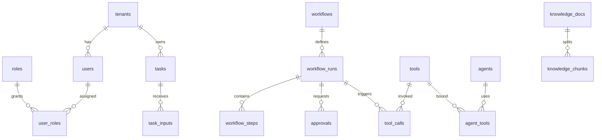

# ERD (Text)

```mermaid
erDiagram
  tenants ||--o{ users : has
  users ||--o{ user_roles : assigned
  roles ||--o{ user_roles : grants
  tenants ||--o{ tasks : owns
  tasks ||--o{ task_inputs : receives
  workflows ||--o{ workflow_runs : defines
  workflow_runs ||--o{ workflow_steps : contains
  agents ||--o{ agent_tools : uses
  tools ||--o{ agent_tools : bound
  tools ||--o{ tool_calls : invoked
  workflow_runs ||--o{ tool_calls : triggers
  workflow_runs ||--o{ approvals : requests
  knowledge_docs ||--o{ knowledge_chunks : splits
```

See `infra/db/init/01_schema.sql` for canonical schema.
