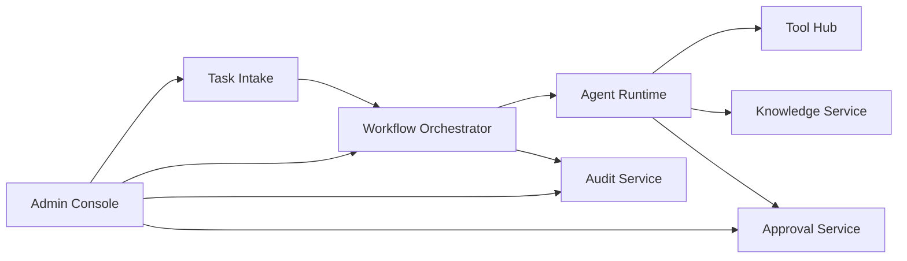

# BizFlow Agent Hub - Architecture Overview

## Product Goals
BizFlow Agent Hub is a workflow-first automation platform that ingests tasks from multiple sources, orchestrates durable workflows, and routes work through specialized agents and governed tools. The system is designed for auditability, retries, approvals, and enterprise-grade observability.

## Scope
- Task intake from REST, email webhook, scheduler, and manual admin form.
- Durable workflow orchestration with retries and step history.
- Agent runtime with structured I/O, tool invocation, policy checks, and handoff.
- Approval workflow for sensitive actions.
- Auditable logs, metrics, and tracing.

## Design Principles
- Workflow-first orchestration (agents are steps, not the orchestrator).
- Modular services with clear contracts.
- Production-oriented defaults (observability, security, governance).
- Easy extensibility for new workflows, agents, and tools.
- Replay-friendly logs and deterministic orchestration state.

## High-Level System Diagram

## Core Components
- **API Gateway / Task Intake**: Accepts tasks and normalizes input into workflow runs.
- **Workflow Orchestrator**: Durable state machine, retries, step history, and replay logs.
- **Agent Runtime**: Executes agent graph; routing, planning, context loading, policy checks.
- **Tool Hub**: Governs tool invocation, permissions, and audit logging.
- **Approval Service**: Approval queue and decision API.
- **Knowledge Service**: Document and chunk retrieval for context.
- **Audit / Observability**: Structured logs, tracing, and metrics.
- **Admin Console**: UI for tasks, runs, approvals, audit, tools, and agents.

## Data Flow
1. Task intake receives a request and creates a Task record.
2. Orchestrator creates a WorkflowRun and initial steps.
3. Agent runtime executes routing/planning/context/policy/execution.
4. Tool Hub executes or queues actions requiring approval.
5. Approval Service manages decisions.
6. Audit Service stores immutable records.
7. Admin Console visualizes everything.
